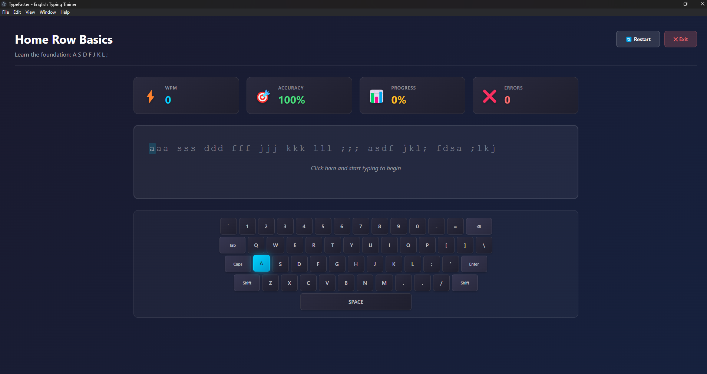

<div align="center">
  
  
  # TypeFaster ⌨️
  
  [](https://opensource.org/licenses/MIT)
  [](https://www.electronjs.org/)
  [](https://vuejs.org/)
  [](https://www.typescriptlang.org/)
  
  **A modern, open-source typing trainer application for learning touch typing in English.**
  
  Built with Electron, Vue 3, TypeScript, and Pinia.
  
</div>



## ✨ Features

### 📚 Comprehensive Lesson System

- **Home Row Basics** - Master the foundation keys (ASDF JKL;)
- **Top Row Training** - Practice QWERTY row
- **Bottom Row Mastery** - Learn ZXCVBNM keys
- **Numbers & Symbols** - Type digits and special characters
- **Difficult Combinations** - Tackle tricky letter sequences
- **Real Words & Sentences** - Practice with actual text
- **Paragraphs** - Longer passages for advanced practice
- **Code Typing** - HTML, CSS, JavaScript, and Python snippets

### 🎯 Progressive Learning

- Structured lessons from beginner to advanced
- Target WPM and accuracy goals for each lesson
- Difficulty-based categorization
- 35+ unique lessons covering all aspects of typing

### ⚡ Real-Time Feedback

- Live WPM (Words Per Minute) calculation
- Instant accuracy percentage
- Character-by-character validation
- Visual error highlighting
- Progress tracking as you type

### 🎨 Visual Keyboard Guide

- Interactive virtual keyboard
- Highlighted keys show next character
- Proper finger placement guidance
- Modern, attractive design

### 📊 Progress Tracking

- Detailed statistics dashboard
- Historical performance data
- Best WPM records
- Average accuracy metrics
- Recent activity log
- Per-lesson progress tracking

### 🌙 Beautiful UI/UX

- Modern dark theme optimized for reduced eye strain
- Smooth animations and transitions
- Responsive design
- Glass-morphism effects
- Gradient accents

## 🚀 Getting Started

### Prerequisites

- **Node.js** (v18 or higher)
- **npm** or **yarn**

### Installation

1. Clone the repository:

```bash
git clone https://github.com/yourusername/type-faster.git
cd type-faster
```

2. Install dependencies:

```bash
npm install
```

3. Run in development mode:

```bash
npm run electron:dev
```

### Building

Build for your current platform:

```bash
npm run build
```

Build for specific platforms:

```bash
npm run build:win    # Windows
npm run build:mac    # macOS
npm run build:linux  # Linux
```

The built application will be in the `release/` directory.

## 🎮 How to Use

1. **Start the Application** - Launch TypeFaster from your applications folder or by running `npm run electron:dev`

2. **Choose a Lesson** - Click "Start Practice" and select a lesson category and difficulty level

3. **Begin Typing** - Click in the typing area and start typing the displayed text
   - Green characters = correct
   - Red characters = incorrect
   - Watch the virtual keyboard highlight the next key

4. **Track Your Progress** - Monitor your WPM, accuracy, and progress in real-time

5. **Complete the Lesson** - Finish typing all characters to see your results

6. **View Statistics** - Check your overall performance and progress over time

## 🛠️ Tech Stack

- **[Electron](https://www.electronjs.org/)** - Cross-platform desktop app framework
- **[Vue 3](https://vuejs.org/)** - Progressive JavaScript framework
- **[TypeScript](https://www.typescriptlang.org/)** - Typed JavaScript
- **[Pinia](https://pinia.vuejs.org/)** - Vue state management
- **[Vite](https://vitejs.dev/)** - Next-generation frontend tooling
- **[Vue Router](https://router.vuejs.org/)** - Official router for Vue.js

## 📁 Project Structure

```
type-faster/
├── electron/           # Electron main process
│   ├── main.ts        # Main process entry
│   └── preload.ts     # Preload script
├── src/
│   ├── components/    # Vue components
│   │   ├── TypingArea.vue
│   │   ├── VirtualKeyboard.vue
│   │   └── StatsPanel.vue
│   ├── views/         # Page components
│   │   ├── Home.vue
│   │   ├── LessonSelector.vue
│   │   ├── TypingLesson.vue
│   │   ├── Results.vue
│   │   └── Statistics.vue
│   ├── stores/        # Pinia stores
│   │   ├── lesson.ts
│   │   ├── progress.ts
│   │   └── settings.ts
│   ├── data/          # Lesson content
│   │   └── lessons.ts
│   ├── types/         # TypeScript types
│   │   └── index.ts
│   ├── styles/        # Global styles
│   │   └── main.css
│   ├── router/        # Vue Router
│   │   └── index.ts
│   ├── App.vue        # Root component
│   └── main.ts        # App entry point
├── public/            # Static assets
├── package.json
├── vite.config.ts     # Vite configuration
├── tsconfig.json      # TypeScript config
└── README.md
```

## 🎨 Customization

### Adding New Lessons

Edit `src/data/lessons.ts` to add new lessons:

```typescript
{
  id: 'custom-001',
  title: 'Your Custom Lesson',
  description: 'Description of the lesson',
  category: 'words', // or other category
  difficulty: 'beginner', // beginner | intermediate | advanced
  content: 'The text content to type...',
  targetWPM: 30,
  targetAccuracy: 95
}
```

### Modifying Themes

Edit color schemes in `src/styles/main.css` and component styles.

## 🤝 Contributing

Contributions are welcome! Here's how you can help:

1. Fork the repository
2. Create a feature branch (`git checkout -b feature/amazing-feature`)
3. Commit your changes (`git commit -m 'Add amazing feature'`)
4. Push to the branch (`git push origin feature/amazing-feature`)
5. Open a Pull Request

### Ideas for Contributions

- Add new lesson content
- Implement sound effects
- Add more themes (light mode, custom colors)
- Create additional statistics visualizations
- Add lesson creator/editor
- Implement multiplayer/competitive mode
- Add keyboard layout options (Dvorak, Colemak, etc.)
- Localization for other languages

## 📝 License

This project is licensed under the MIT License - see the [LICENSE](LICENSE) file for details.

## 🙏 Acknowledgments

- Inspired by popular typing trainers like KeaBr, TypeRacer, and Monkeytype
- Built with modern web technologies
- Community-driven open-source project

## 📧 Contact

For questions, suggestions, or issues, please open an issue on GitHub.

---

**Happy Typing! 🚀**

Made with ❤️ by the TypeFaster Team
